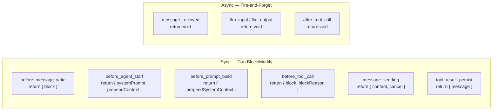
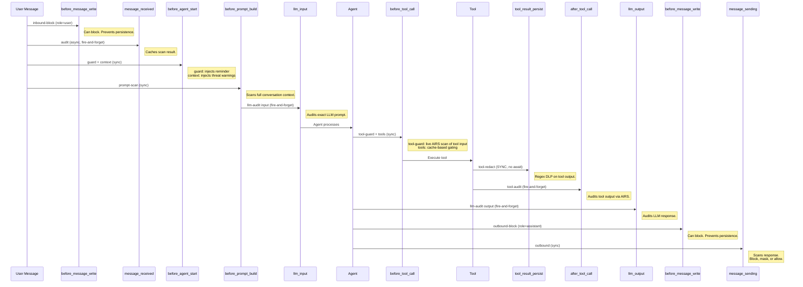
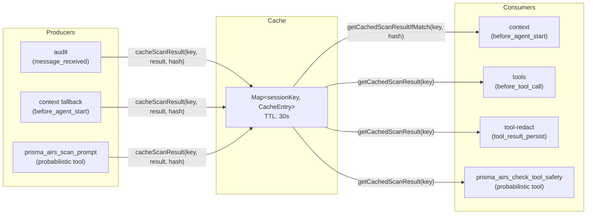

# Hook Lifecycle

## Hook Discovery

All 12 hooks are auto-discovered by OpenClaw from `HOOK.md` frontmatter files in the `hooks/` directory. No `api.on()` registration occurs in `index.ts`. Each handler checks its own mode via `ctx.cfg` and returns early if disabled.

## The 9 OpenClaw Event Types Used



> **Interactive version**: [Open in Excalidraw](https://excalidraw.com/#json=1nwlp7wDbZ6oXcq-SS2md,VM9DjKucXCFK5uldPpui3Q){ target="_blank" } — full hook execution lifecycle diagram with all 12 hooks.

| Event                  | Sync/Async       | Can Block | Return Type                            | Hooks Using It                  |
| ---------------------- | ---------------- | --------- | -------------------------------------- | ------------------------------- |
| `before_message_write` | Sync             | Yes       | `{ block: boolean }` or void          | inbound-block, outbound-block   |
| `before_agent_start`   | Sync             | No*       | `{ systemPrompt?, prependContext? }`   | guard, context                  |
| `before_prompt_build`  | Sync             | No*       | `{ prependSystemContext? }`            | prompt-scan                     |
| `before_tool_call`     | Sync             | Yes       | `{ block?, blockReason? }` or void    | tool-guard, tools               |
| `message_sending`      | Sync             | Yes       | `{ content?, cancel? }` or void       | outbound                        |
| `tool_result_persist`  | **Sync (no await)** | No     | `{ message? }` or void                | tool-redact                     |
| `message_received`     | Async void       | No        | void                                   | audit                           |
| `llm_input`            | Async void       | No        | void                                   | llm-audit                       |
| `llm_output`           | Async void       | No        | void                                   | llm-audit                       |
| `after_tool_call`      | Async void       | No        | void                                   | tool-audit                      |

*Cannot block directly, but can inject context/warnings that instruct the agent to refuse.

## All 12 Hooks

### 1. prisma-airs-inbound-block

| Property    | Value                               |
| ----------- | ----------------------------------- |
| Event       | `before_message_write`              |
| Mode config | `inbound_block_mode` (deterministic / off) |
| Sync        | Yes                                 |
| Can block   | Yes, returns `{ block: true }`      |
| Scans       | `scan({ prompt: content })` (live)  |
| Filter      | Only `role === "user"` messages     |

Blocks user messages at the persistence layer unless AIRS returns `action === "allow"`. Blocked messages are never written to conversation history. Fail-closed: blocks on scan error.

### 2. prisma-airs-outbound-block

| Property    | Value                               |
| ----------- | ----------------------------------- |
| Event       | `before_message_write`              |
| Mode config | `outbound_block_mode` (deterministic / off) |
| Sync        | Yes                                 |
| Can block   | Yes, returns `{ block: true }`      |
| Scans       | `scan({ response: content })` (live) |
| Filter      | Only `role === "assistant"` messages |

Blocks assistant messages at the persistence layer unless AIRS returns `action === "allow"`. Fail-closed: blocks on scan error.

### 3. prisma-airs-audit

| Property    | Value                               |
| ----------- | ----------------------------------- |
| Event       | `message_received`                  |
| Mode config | `audit_mode` (deterministic / probabilistic / off) |
| Sync        | No (fire-and-forget)                |
| Can block   | No                                  |
| Scans       | `scan({ prompt: content })` (live)  |
| Writes cache| `cacheScanResult(sessionKey, result, msgHash)` |

Scans inbound messages for audit logging. Populates scan cache for downstream hooks (context, tools). On error with `fail_closed=true`, caches synthetic block result: `{ action: "block", severity: "CRITICAL", categories: ["scan-failure"] }`.

### 4. prisma-airs-guard

| Property    | Value                               |
| ----------- | ----------------------------------- |
| Event       | `before_agent_start`                |
| Mode config | `reminder_mode` (on / off)          |
| Sync        | Yes                                 |
| Can block   | No                                  |
| Scans       | None (no AIRS call)                 |

Returns `{ systemPrompt: reminderText }`. The reminder content varies by mode:

- **All deterministic**: Short reminder about block/warn/allow directives
- **All probabilistic**: Detailed instructions listing `prisma_airs_scan_prompt`, `prisma_airs_scan_response`, `prisma_airs_check_tool_safety` tools
- **Mixed**: Lists which features are automatic vs manual with tool names

### 5. prisma-airs-context

| Property    | Value                               |
| ----------- | ----------------------------------- |
| Event       | `before_agent_start`                |
| Mode config | `context_injection_mode` (deterministic / probabilistic / off) |
| Sync        | Yes                                 |
| Can block   | No (injects warnings)               |
| Reads cache | `getCachedScanResultIfMatch(sessionKey, msgHash)` |
| Scans       | Fallback `scan({ prompt })` on cache miss |

Checks scan cache first (populated by audit hook). On cache miss, performs its own scan and caches the result for downstream hooks. Returns `{ prependContext: warning }` with threat-specific instructions when `action !== "allow"` or `severity !== "SAFE"`. Clears cache on safe results (no need for tool gating).

Threat instructions are category-specific (35 entries in `THREAT_INSTRUCTIONS` map covering suffixed and unsuffixed variants).

### 6. prisma-airs-prompt-scan

| Property    | Value                               |
| ----------- | ----------------------------------- |
| Event       | `before_prompt_build`               |
| Mode config | `prompt_scan_mode` (deterministic / off) |
| Sync        | Yes                                 |
| Can block   | No (injects warnings)               |
| Scans       | `scan({ prompt: assembledContext })` (live) |

Assembles all conversation messages into a single string (`[role]: content` per line) and scans the full context. Returns `{ prependSystemContext: warning }` when threats detected. Catches multi-message injection attacks that per-message scanning misses.

### 7. prisma-airs-tool-guard

| Property    | Value                               |
| ----------- | ----------------------------------- |
| Event       | `before_tool_call`                  |
| Mode config | `tool_guard_mode` (deterministic / off) |
| Sync        | Yes                                 |
| Can block   | Yes, returns `{ block: true, blockReason }` |
| Scans       | `scan({ toolEvents: [{ metadata, input }] })` (live, via `toolEvent` content type) |

Active AIRS scanning of tool inputs. Sends tool metadata (ecosystem: `"mcp"`, method: `"tool_call"`, serverName, toolInvoked) and serialized params as `input`. Blocks unless AIRS returns `action === "allow"`. Fail-closed: blocks on scan error.

### 8. prisma-airs-tools

| Property    | Value                               |
| ----------- | ----------------------------------- |
| Event       | `before_tool_call`                  |
| Mode config | `tool_gating_mode` (deterministic / probabilistic / off) |
| Sync        | Yes                                 |
| Can block   | Yes, returns `{ block: true, blockReason }` |
| Reads cache | `getCachedScanResult(sessionKey)`   |
| Scans       | None (cache-only, no AIRS call)     |

Cache-based tool gating. Reads the scan result cached by audit/context hooks. If a threat is detected, blocks tools matching category-specific lists (`TOOL_BLOCKS` map) plus configurable `high_risk_tools`. No AIRS API call at decision time.

Tool block lists by category:

| Category        | Blocked Tools                                |
| --------------- | -------------------------------------------- |
| agent_threat    | All 18 external tools                        |
| sql-injection / db_security | exec, Bash, database, query, sql, eval |
| malicious_code  | exec, Bash, write, Edit, eval, NotebookEdit  |
| prompt_injection| exec, Bash, gateway, message, cron           |
| malicious_url   | web_fetch, WebFetch, browser, curl            |
| toxic_content   | Same as malicious_code                       |
| topic_violation | exec, Bash, gateway, message, cron, write, Edit |
| scan-failure    | exec, Bash, gateway, message, cron, write, Edit |

Default `high_risk_tools` (blocked on ANY threat): `exec, Bash, bash, write, Write, edit, Edit, gateway, message, cron`.

### 9. prisma-airs-outbound

| Property    | Value                               |
| ----------- | ----------------------------------- |
| Event       | `message_sending`                   |
| Mode config | `outbound_mode` (deterministic / probabilistic / off) |
| Sync        | Yes                                 |
| Can block   | Yes, returns `{ content: blockMessage }` |
| Scans       | `scan({ response: content })` (live) |

Scans outbound responses. **Blocks on ANY non-allow action** (both `warn` and `block`). DLP-only violations are masked instead of blocked when `dlp_mask_only=true` (default). Uses regex-based `maskSensitiveData()` for SSN, credit cards, emails, API keys, AWS keys, phone numbers, private IPs.

### 10. prisma-airs-tool-redact

| Property    | Value                               |
| ----------- | ----------------------------------- |
| Event       | `tool_result_persist`               |
| Mode config | `tool_redact_mode` (deterministic / off) |
| Sync        | **Yes (synchronous handler, not async)** |
| Can block   | No, modifies content                |
| Reads cache | `getCachedScanResult(sessionKey)` for DLP signal |
| Scans       | None (regex-only, no AIRS call)     |

Applies regex DLP masking to tool result content before session persistence. The handler function signature is synchronous (`(event, ctx): HookResult | void` -- no `Promise`). Skips synthetic results (`event.isSynthetic`). Same regex patterns as outbound handler.

### 11. prisma-airs-llm-audit

| Property    | Value                               |
| ----------- | ----------------------------------- |
| Event       | `llm_input` and `llm_output`        |
| Mode config | `llm_audit_mode` (deterministic / off) |
| Sync        | No (fire-and-forget)                |
| Can block   | No                                  |
| Scans       | `scan({ prompt })` for input, `scan({ response })` for output |

Dispatches based on `event.hookEvent` discriminator. For `llm_input`: scans system prompt + user prompt concatenated. For `llm_output`: scans concatenated `event.assistantTexts`. Logs structured JSON with provider, model, usage stats.

### 12. prisma-airs-tool-audit

| Property    | Value                               |
| ----------- | ----------------------------------- |
| Event       | `after_tool_call`                   |
| Mode config | `tool_audit_mode` (deterministic / off) |
| Sync        | No (fire-and-forget)                |
| Can block   | No                                  |
| Scans       | `scan({ response: resultStr, toolEvents: [...] })` (live) |

Scans tool execution results. Sends the serialized result as both `response` content and within a `toolEvent` (ecosystem: `"mcp"`, method: `"tool_result"`, serverName: `"local"`). Complements tool-guard (pre-execution) with post-execution audit.

## Hook Execution Order



## Scan Cache Data Sharing

The scan cache enables data sharing between hooks that fire at different times in the request lifecycle.



### Race Condition Between Async and Sync Hooks

```
Timeline A (fast scan — normal case):
  T0: message_received starts (async)
  T1: scan completes, result cached with msgHash
  T2: before_agent_start fires → getCachedScanResultIfMatch() → HIT

Timeline B (slow scan — race condition):
  T0: message_received starts (async)
  T1: before_agent_start fires → getCachedScanResultIfMatch() → MISS
  T2: context hook does fallback scan, caches result
  T3: original scan completes (overwrites cache, harmless)
```

The `context` hook handles this race by falling back to its own scan on cache miss. The `messageHash` check in `getCachedScanResultIfMatch()` prevents using stale results from a previous message in the same session.

## Hooks That Do NOT Call AIRS

Three hooks avoid AIRS API calls at decision time:

| Hook        | Why                                                          |
| ----------- | ------------------------------------------------------------ |
| guard       | Static reminder injection, no scanning needed                |
| tools       | Reads cached result from audit/context scan                  |
| tool-redact | `tool_result_persist` is synchronous (no await); uses regex DLP only |

## Mode Behavior Per Hook

| Hook            | `deterministic`              | `probabilistic`                      | `off`    |
| --------------- | ---------------------------- | ------------------------------------ | -------- |
| guard           | N/A (`on`/`off` only)        | N/A                                  | Skip     |
| audit           | Hook runs                    | Tool: `prisma_airs_scan_prompt`      | Skip     |
| context         | Hook runs                    | Tool: `prisma_airs_scan_prompt`      | Skip     |
| outbound        | Hook runs                    | Tool: `prisma_airs_scan_response`    | Skip     |
| tools           | Hook runs                    | Tool: `prisma_airs_check_tool_safety`| Skip     |
| inbound-block   | Hook runs                    | N/A (deterministic/off only)         | Skip     |
| outbound-block  | Hook runs                    | N/A (deterministic/off only)         | Skip     |
| tool-guard      | Hook runs                    | N/A (deterministic/off only)         | Skip     |
| prompt-scan     | Hook runs                    | N/A (deterministic/off only)         | Skip     |
| tool-redact     | Hook runs                    | N/A (deterministic/off only)         | Skip     |
| llm-audit       | Hook runs                    | N/A (deterministic/off only)         | Skip     |
| tool-audit      | Hook runs                    | N/A (deterministic/off only)         | Skip     |

> **Important**: Each hook independently checks its own mode via `ctx.cfg`. The `probabilistic` column describes what `index.ts` registers as a replacement tool -- the hook handler itself simply checks `if (mode === "off") return;` and the mode string comes from its own config key.
