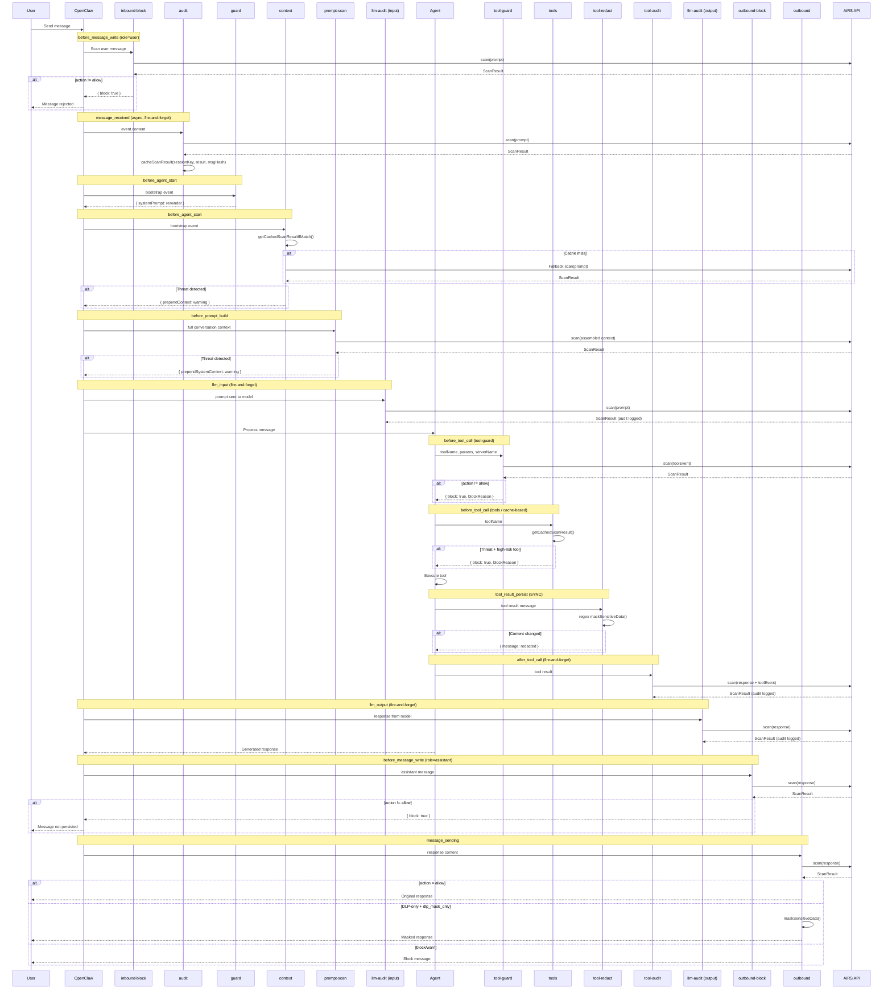
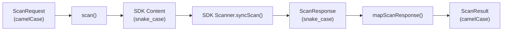
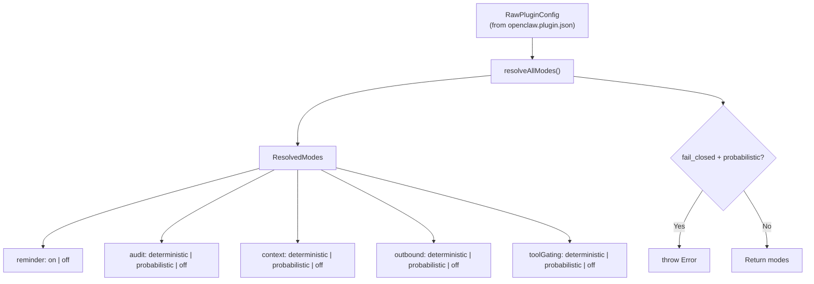
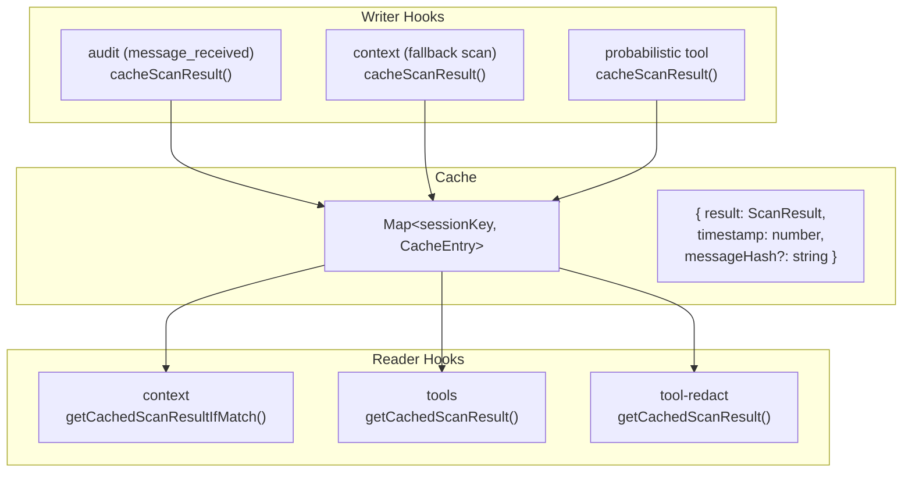
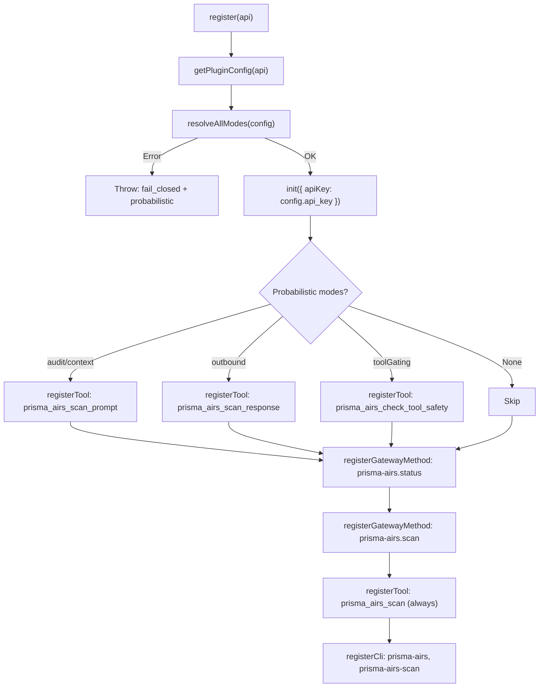

# Architecture Overview

## Plugin Components

| Component        | File                 | Purpose                                                        |
| ---------------- | -------------------- | -------------------------------------------------------------- |
| **Plugin Entry** | `index.ts`           | SDK init, mode resolution, RPC methods, tools, CLI             |
| **Scanner**      | `src/scanner.ts`     | SDK adapter: `ScanRequest` / `ScanResult`, `scan()`, `mapScanResponse()` |
| **Config**       | `src/config.ts`      | `FeatureMode` tri-state, `ReminderMode`, `resolveAllModes()`  |
| **Scan Cache**   | `src/scan-cache.ts`  | In-memory TTL cache sharing scan results between hooks         |
| **Hooks (12)**   | `hooks/*/handler.ts` | Auto-discovered event handlers for 9 OpenClaw hook events      |

Version: `1.0.0` (declared in `package.json`, `openclaw.plugin.json`, and 3 places in `index.ts`).

## Component Relationships

```mermaid
graph TB
    subgraph "Plugin Entry (index.ts)"
        REG[register&#40;api&#41;]
        RPC["RPC: prisma-airs.status<br/>RPC: prisma-airs.scan"]
        CLI["CLI: prisma-airs<br/>CLI: prisma-airs-scan"]
        TOOLS["Tools: prisma_airs_scan<br/>+ probabilistic tools"]
    end

    subgraph "Core Modules"
        CFG["config.ts<br/>resolveAllModes()"]
        SCAN["scanner.ts<br/>scan() / mapScanResponse()"]
        CACHE["scan-cache.ts<br/>cacheScanResult() / getCachedScanResult()"]
    end

    subgraph "External"
        SDK["@cdot65/prisma-airs-sdk<br/>init() / Scanner / Content"]
        AIRS["Prisma AIRS API"]
    end

    subgraph "12 Hook Handlers"
        H_GUARD["guard<br/>before_agent_start"]
        H_AUDIT["audit<br/>message_received"]
        H_CONTEXT["context<br/>before_agent_start"]
        H_PSCAN["prompt-scan<br/>before_prompt_build"]
        H_INBLOCK["inbound-block<br/>before_message_write"]
        H_OUTBLOCK["outbound-block<br/>before_message_write"]
        H_OUTBOUND["outbound<br/>message_sending"]
        H_TOOLS["tools<br/>before_tool_call"]
        H_TGUARD["tool-guard<br/>before_tool_call"]
        H_TREDACT["tool-redact<br/>tool_result_persist"]
        H_LLM["llm-audit<br/>llm_input / llm_output"]
        H_TAUDIT["tool-audit<br/>after_tool_call"]
    end

    REG --> CFG
    REG --> SDK
    RPC --> SCAN
    TOOLS --> SCAN
    CLI --> SCAN

    SCAN --> SDK
    SDK --> AIRS

    H_AUDIT --> SCAN
    H_AUDIT --> CACHE
    H_CONTEXT --> SCAN
    H_CONTEXT --> CACHE
    H_PSCAN --> SCAN
    H_INBLOCK --> SCAN
    H_OUTBLOCK --> SCAN
    H_OUTBOUND --> SCAN
    H_TGUARD --> SCAN
    H_TOOLS --> CACHE
    H_TREDACT --> CACHE
    H_LLM --> SCAN
    H_TAUDIT --> SCAN
    H_GUARD --> CFG
```



> **Interactive version**: [Open in Excalidraw](https://excalidraw.com/#json=tRUS4db9JK8MPdCVLlG0K,10uBMRHW5MIjejef7oLoqA){ target="_blank" } — zoom, pan, and edit the architecture diagram.

## Full Request Lifecycle



## Scanner Adapter Layer

The scanner (`src/scanner.ts`) is an adapter between the plugin and the SDK:

- **Input**: Plugin-defined `ScanRequest` (camelCase)
- **SDK call**: `new Scanner().syncScan({ profile_name }, content, opts)` via `@cdot65/prisma-airs-sdk`
- **Output**: Plugin-defined `ScanResult` (camelCase) via `mapScanResponse()`



### SDK Initialization

The SDK is initialized once in `register()`:

```typescript
import { init } from "@cdot65/prisma-airs-sdk";

// In register():
if (config.api_key) {
  init({ apiKey: config.api_key });
}
```

`scan()` checks `globalConfiguration.initialized` before every call. If not initialized, it returns a synthetic `warn` result with `error: "SDK not initialized"`.

### Action Mapping

| AIRS API `action` | Plugin `Action` |
| ----------------- | --------------- |
| `"allow"`         | `"allow"`       |
| `"alert"`         | `"warn"`        |
| `"block"`         | `"block"`       |

### Severity Derivation

Severity is derived from `category` and `action`, not from a direct API field:

| Condition                              | Severity     |
| -------------------------------------- | ------------ |
| `category == "malicious"` or `action == "block"` | `CRITICAL` |
| `category == "suspicious"`             | `HIGH`       |
| Any detection flag true                | `MEDIUM`     |
| Otherwise                              | `SAFE`       |

### Content Types

The SDK `Content` object supports three content types:

- `prompt` — user message text
- `response` — assistant response text
- `toolEvent` — single tool event with `metadata` (ecosystem, method, server_name, tool_invoked) + optional `input`/`output`

> **Note**: SDK supports a single `toolEvent` per `Content`, not an array. The plugin takes `request.toolEvents[0]` when present.

## Configuration System

`src/config.ts` defines the mode resolution system:



**Defaults**: All features default to `deterministic`. `fail_closed` defaults to `true`. `reminder_mode` defaults to `"on"`.

> **Important**: `fail_closed=true` rejects any `probabilistic` mode at registration time by throwing an error. This validation runs in `register()` before hooks are active.

### Mode Effects

| Mode              | Behavior                                              |
| ----------------- | ----------------------------------------------------- |
| `deterministic`   | Hook runs automatically on every event                |
| `probabilistic`   | Hook skipped; equivalent tool registered for model to call |
| `off`             | Feature completely disabled                           |

Only 4 features support `probabilistic`: audit, context, outbound, toolGating. The remaining 8 hooks only support `deterministic` / `off`.

## Scan Cache Architecture

`src/scan-cache.ts` bridges async and sync hooks:



| Parameter       | Value      | Purpose                                          |
| --------------- | ---------- | ------------------------------------------------ |
| TTL             | 30 seconds | Long enough for hook chain, short enough for freshness |
| Cleanup interval| 60 seconds | Evicts expired entries via `setInterval`          |
| Hash function   | DJB2 variant | 32-bit integer hash of message content for stale detection |

### Cache API

| Function                      | Used By                           | Purpose                                |
| ----------------------------- | --------------------------------- | -------------------------------------- |
| `cacheScanResult(key, result, hash?)` | audit, context, probabilistic tools | Store scan result               |
| `getCachedScanResult(key)`    | tools, tool-redact                | Get result (TTL-checked)               |
| `getCachedScanResultIfMatch(key, hash)` | context                  | Get result only if message hash matches |
| `clearScanResult(key)`        | context (on safe result)          | Remove entry                           |
| `hashMessage(content)`        | audit, context, probabilistic tools | Generate message hash               |

## Plugin Registration Flow



> **Note**: Hooks are NOT registered via `api.on()`. All 12 hooks are auto-discovered by OpenClaw from `HOOK.md` files in the `hooks/` directory. Each handler self-checks its own mode via `ctx.cfg`.

## Error Handling

### Fail-Closed (Default: `fail_closed=true`)

Each hook implements fail-closed independently:

| Hook             | On scan failure                                      |
| ---------------- | ---------------------------------------------------- |
| audit            | Caches synthetic `{ action: "block", severity: "CRITICAL", categories: ["scan-failure"] }` |
| context          | Injects block-level warning via `prependContext`      |
| inbound-block    | Returns `{ block: true }`                            |
| outbound-block   | Returns `{ block: true }`                            |
| outbound         | Replaces content with apology message                |
| tool-guard       | Returns `{ block: true, blockReason: "scan failed" }` |
| prompt-scan      | Injects warning via `prependSystemContext`            |

### Fail-Open (`fail_closed=false`)

On scan failure: log error, return void (no blocking, no warning).

### SDK Not Initialized

`scan()` returns a synthetic result without calling the API:
```typescript
{ action: "warn", severity: "LOW", categories: ["api_error"], error: "SDK not initialized..." }
```
