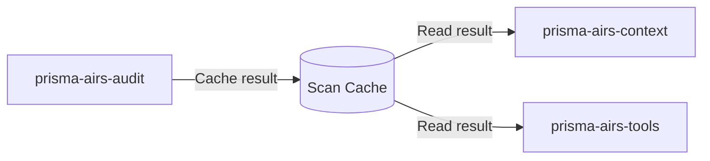

# Hooks Overview

The Prisma AIRS plugin provides 5 security hooks that work together for defense-in-depth.

## Hook Summary

| Hook                                            | Event                | Purpose                 | Can Block |
| ----------------------------------------------- | -------------------- | ----------------------- | --------- |
| [prisma-airs-guard](prisma-airs-guard.md)       | `before_agent_start` | Remind agents to scan   | No        |
| [prisma-airs-audit](prisma-airs-audit.md)       | `message_received`   | Audit logging + caching | No        |
| [prisma-airs-context](prisma-airs-context.md)   | `before_agent_start` | Inject threat warnings  | No\*      |
| [prisma-airs-outbound](prisma-airs-outbound.md) | `message_sending`    | Block/mask responses    | Yes       |
| [prisma-airs-tools](prisma-airs-tools.md)       | `before_tool_call`   | Block dangerous tools   | Yes       |

\*Cannot block directly, but can influence agent behavior via context

## Execution Order

```mermaid
flowchart TB
    subgraph Bootstrap
        A[Agent starts] --> B[prisma-airs-guard]
        B --> C[Security reminder added]
    end

    subgraph "Message Processing"
        D[Message arrives] --> E[prisma-airs-audit]
        E --> F[Scan + Cache]
        F --> G[prisma-airs-context]
        G --> H{Threat?}
        H -->|Yes| I[Inject warning]
        H -->|No| J[Continue]
    end

    subgraph "Agent Execution"
        K[Agent runs] --> L[Tool call]
        L --> M[prisma-airs-tools]
        M --> N{Blocked?}
        N -->|Yes| O[Block tool]
        N -->|No| P[Execute tool]
    end

    subgraph "Response"
        Q[Agent response] --> R[prisma-airs-outbound]
        R --> S{Action?}
        S -->|Block| T[Replace with error]
        S -->|DLP| U[Mask sensitive data]
        S -->|Allow| V[Send original]
    end
```



## Configuration

Each hook can be individually enabled/disabled:

```yaml
plugins:
  prisma-airs:
    reminder_enabled: true # prisma-airs-guard
    audit_enabled: true # prisma-airs-audit
    context_injection_enabled: true # prisma-airs-context
    outbound_scanning_enabled: true # prisma-airs-outbound
    tool_gating_enabled: true # prisma-airs-tools
```

## Data Sharing

Hooks share data via the scan cache:



- **TTL**: 30 seconds
- **Key**: Session ID or conversation ID
- **Validation**: Message hash prevents stale results

## Recommended Configurations

### Maximum Security

All hooks enabled, fail-closed:

```yaml
plugins:
  prisma-airs:
    fail_closed: true
    reminder_enabled: true
    audit_enabled: true
    context_injection_enabled: true
    outbound_scanning_enabled: true
    tool_gating_enabled: true
    dlp_mask_only: false # Block instead of mask
```

### Audit Only

Log threats without enforcement:

```yaml
plugins:
  prisma-airs:
    reminder_enabled: false
    audit_enabled: true
    context_injection_enabled: false
    outbound_scanning_enabled: false
    tool_gating_enabled: false
```

### Outbound Only

Only scan responses:

```yaml
plugins:
  prisma-airs:
    reminder_enabled: false
    audit_enabled: false
    context_injection_enabled: false
    outbound_scanning_enabled: true
    tool_gating_enabled: false
```
