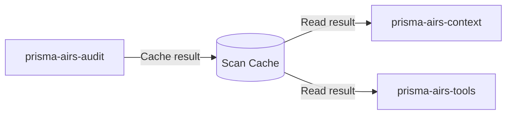

# Hooks Overview

The Prisma AIRS plugin provides 12 security hooks that work together for defense-in-depth.

## Hook Summary

| Hook                                                              | Event                  | Purpose                         | Can Block |
| ----------------------------------------------------------------- | ---------------------- | ------------------------------- | --------- |
| [prisma-airs-guard](prisma-airs-guard.md)                         | `before_agent_start`   | Remind agents to scan           | No        |
| [prisma-airs-audit](prisma-airs-audit.md)                         | `message_received`     | Audit logging + caching         | No        |
| [prisma-airs-context](prisma-airs-context.md)                     | `before_agent_start`   | Inject threat warnings          | No\*      |
| [prisma-airs-prompt-scan](prisma-airs-prompt-scan.md)             | `before_prompt_build`  | Full context scanning           | No\*\*    |
| [prisma-airs-inbound-block](prisma-airs-inbound-block.md)         | `before_message_write` | Block unsafe user messages      | Yes       |
| [prisma-airs-outbound-block](prisma-airs-outbound-block.md)       | `before_message_write` | Block unsafe assistant msgs     | Yes       |
| [prisma-airs-outbound](prisma-airs-outbound.md)                   | `message_sending`      | Block/mask responses            | Yes       |
| [prisma-airs-tools](prisma-airs-tools.md)                         | `before_tool_call`     | Block tools (cached result)     | Yes       |
| [prisma-airs-tool-guard](prisma-airs-tool-guard.md)               | `before_tool_call`     | Scan tool inputs via AIRS       | Yes       |
| [prisma-airs-tool-redact](prisma-airs-tool-redact.md)             | `tool_result_persist`  | Redact PII from tool outputs    | No\*\*\*  |
| [prisma-airs-llm-audit](prisma-airs-llm-audit.md)                | `llm_input/llm_output` | Audit log LLM I/O              | No        |
| [prisma-airs-tool-audit](prisma-airs-tool-audit.md)              | `after_tool_call`      | Audit log tool outputs          | No        |

\*\*\*Modifies persisted message content — does not block tool execution

\*\*Injects warnings via `prependSystemContext` — cannot block directly

\*Cannot block directly, but can influence agent behavior via context

## Execution Order


```mermaid
flowchart TB
    subgraph Bootstrap
        A[Agent starts] --> B[prisma-airs-guard]
        B --> C[Security reminder added]
    end

    subgraph "Message Processing"
        D[Message arrives] --> E[prisma-airs-audit]
        E --> F[Scan + Cache]
        F --> G[prisma-airs-context]
        G --> H{Threat?}
        H -->|Yes| I[Inject warning]
        H -->|No| J[Continue]
    end

    subgraph "Agent Execution"
        K[Agent runs] --> L[Tool call]
        L --> M[prisma-airs-tools]
        M --> N{Blocked?}
        N -->|Yes| O[Block tool]
        N -->|No| P[Execute tool]
    end

    subgraph "Response"
        Q[Agent response] --> R[prisma-airs-outbound]
        R --> S{Action?}
        S -->|Block| T[Replace with error]
        S -->|DLP| U[Mask sensitive data]
        S -->|Allow| V[Send original]
    end
```

## Configuration

Each hook can be individually enabled or disabled. Settings are organized into groups in the web UI and can be searched by tags.

### Connection

```yaml
plugins:
  prisma-airs:
    config:
      api_key: "your-api-key"           # Required
      profile_name: "default"            # AIRS profile from SCM
      app_name: "openclaw"               # App name in scan metadata
```

### Blocking Hooks

Hard guardrails that block content unless AIRS returns `allow`.

```yaml
      inbound_block_mode: "deterministic"    # Block unsafe user messages
      outbound_block_mode: "deterministic"   # Block unsafe assistant messages
      outbound_mode: "deterministic"         # Block/mask outbound responses
      tool_guard_mode: "deterministic"       # Block tools with unsafe inputs
      tool_gating_mode: "deterministic"      # Block tools via cached scan
```

### Scanning Hooks

Inspect content and inject warnings or redact sensitive data.

```yaml
      prompt_scan_mode: "deterministic"      # Scan full conversation context
      tool_redact_mode: "deterministic"      # Redact PII from tool outputs
      context_injection_mode: "deterministic" # Inject threat warnings
      reminder_mode: "on"                    # Security reminder on startup
```

### Audit Hooks

Log scan results for compliance and monitoring (cannot block).

```yaml
      audit_mode: "deterministic"            # Message audit logging
      llm_audit_mode: "deterministic"        # LLM I/O audit logging
      tool_audit_mode: "deterministic"       # Tool output audit logging
```

### Advanced Settings

```yaml
      fail_closed: true                      # Block on scan failure
      dlp_mask_only: true                    # Mask DLP instead of block
      high_risk_tools: ["Bash", "Write"]     # Tools blocked on any threat
```

## Data Sharing

Hooks share data via the scan cache:


```mermaid
flowchart LR
    A[prisma-airs-audit] -->|Cache result| B[(Scan Cache)]
    B -->|Read result| C[prisma-airs-context]
    B -->|Read result| D[prisma-airs-tools]
```

- **TTL**: 30 seconds
- **Key**: Session ID or conversation ID
- **Validation**: Message hash prevents stale results

## Recommended Configurations

### Maximum Security

All hooks enabled, fail-closed:

```yaml
plugins:
  prisma-airs:
    config:
      # Blocking
      inbound_block_mode: "deterministic"
      outbound_block_mode: "deterministic"
      outbound_mode: "deterministic"
      tool_guard_mode: "deterministic"
      tool_gating_mode: "deterministic"
      # Scanning
      prompt_scan_mode: "deterministic"
      tool_redact_mode: "deterministic"
      context_injection_mode: "deterministic"
      reminder_mode: "on"
      # Audit
      audit_mode: "deterministic"
      llm_audit_mode: "deterministic"
      tool_audit_mode: "deterministic"
      # Advanced
      fail_closed: true
      dlp_mask_only: false
```

### Audit Only

Log threats without enforcement:

```yaml
plugins:
  prisma-airs:
    config:
      # Blocking — all off
      inbound_block_mode: "off"
      outbound_block_mode: "off"
      outbound_mode: "off"
      tool_guard_mode: "off"
      tool_gating_mode: "off"
      # Scanning — off
      prompt_scan_mode: "off"
      tool_redact_mode: "off"
      context_injection_mode: "off"
      reminder_mode: "off"
      # Audit — enabled
      audit_mode: "deterministic"
      llm_audit_mode: "deterministic"
      tool_audit_mode: "deterministic"
```

### Blocking Only

Block threats, no audit logging:

```yaml
plugins:
  prisma-airs:
    config:
      # Blocking — enabled
      inbound_block_mode: "deterministic"
      outbound_block_mode: "deterministic"
      outbound_mode: "deterministic"
      tool_guard_mode: "deterministic"
      tool_gating_mode: "deterministic"
      # Scanning
      prompt_scan_mode: "deterministic"
      tool_redact_mode: "deterministic"
      # Audit — off
      audit_mode: "off"
      llm_audit_mode: "off"
      tool_audit_mode: "off"
```
