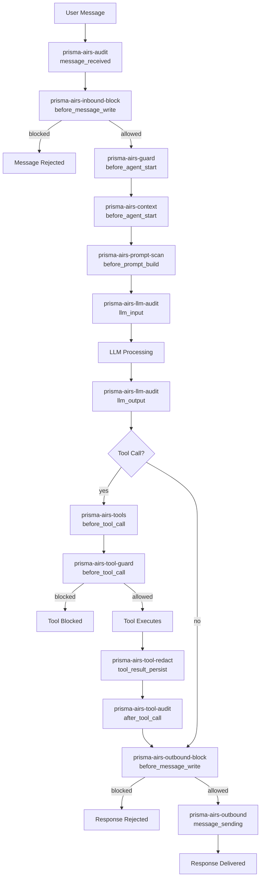
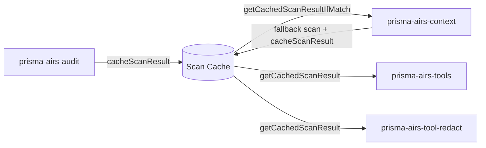

# Hooks Overview

All 12 hooks that secure the OpenClaw agent lifecycle.

## Hook Summary

| Hook | Event | Config Field | Can Block | Default Mode |
|------|-------|-------------|-----------|-------------|
| [prisma-airs-guard](prisma-airs-guard.md) | `before_agent_start` | `reminder_mode` | No | `on` |
| [prisma-airs-audit](prisma-airs-audit.md) | `message_received` | `audit_mode` | No | `deterministic` |
| [prisma-airs-context](prisma-airs-context.md) | `before_agent_start` | `context_injection_mode` | No | `deterministic` |
| [prisma-airs-prompt-scan](prisma-airs-prompt-scan.md) | `before_prompt_build` | `prompt_scan_mode` | No | `deterministic` |
| [prisma-airs-inbound-block](prisma-airs-inbound-block.md) | `before_message_write` | `inbound_block_mode` | Yes | `deterministic` |
| [prisma-airs-outbound-block](prisma-airs-outbound-block.md) | `before_message_write` | `outbound_block_mode` | Yes | `deterministic` |
| [prisma-airs-outbound](prisma-airs-outbound.md) | `message_sending` | `outbound_mode` | Yes | `deterministic` |
| [prisma-airs-tools](prisma-airs-tools.md) | `before_tool_call` | `tool_gating_mode` | Yes | `deterministic` |
| [prisma-airs-tool-guard](prisma-airs-tool-guard.md) | `before_tool_call` | `tool_guard_mode` | Yes | `deterministic` |
| [prisma-airs-tool-redact](prisma-airs-tool-redact.md) | `tool_result_persist` | `tool_redact_mode` | No | `deterministic` |
| [prisma-airs-llm-audit](prisma-airs-llm-audit.md) | `llm_input` / `llm_output` | `llm_audit_mode` | No | `deterministic` |
| [prisma-airs-tool-audit](prisma-airs-tool-audit.md) | `after_tool_call` | `tool_audit_mode` | No | `deterministic` |

## Hook Groups

### Blocking Hooks

Hard guardrails that prevent unsafe content from being persisted or delivered.

- **prisma-airs-inbound-block** -- Blocks user messages at the persistence layer. Returns `{ block: true }` unless AIRS action is `allow`.
- **prisma-airs-outbound-block** -- Blocks assistant messages at the persistence layer. Returns `{ block: true }` unless AIRS action is `allow`.
- **prisma-airs-outbound** -- Scans outbound responses before delivery. Can replace content (DLP masking) or substitute a block message. Blocks on any non-`allow` action.
- **prisma-airs-tools** -- Cache-based tool gating. Blocks tool calls based on cached inbound scan results and category-to-tool mappings.
- **prisma-airs-tool-guard** -- Active AIRS scanning of tool inputs via `toolEvent` content type. Blocks unless AIRS returns `allow`.

### Scanning & Context Hooks

Scan content and inject security warnings into agent context.

- **prisma-airs-guard** -- Injects mode-aware security reminder into system prompt at agent start.
- **prisma-airs-audit** -- Fire-and-forget inbound scan + cache population for downstream hooks.
- **prisma-airs-context** -- Injects threat-specific warnings into agent context (uses cache or fallback scan).
- **prisma-airs-prompt-scan** -- Scans full conversation context before prompt assembly. Catches multi-message injection attacks.
- **prisma-airs-tool-redact** -- Synchronous regex-based DLP redaction of tool output before persistence.

### Audit Hooks

Fire-and-forget logging at critical boundaries.

- **prisma-airs-llm-audit** -- Scans exact LLM input/output through AIRS for audit trail.
- **prisma-airs-tool-audit** -- Scans tool execution results through AIRS for audit trail.

## Execution Order


```mermaid
graph TD
    A[User Message] --> B[prisma-airs-audit<br/>message_received]
    B --> C[prisma-airs-inbound-block<br/>before_message_write]
    C -->|blocked| Z[Message Rejected]
    C -->|allowed| D[prisma-airs-guard<br/>before_agent_start]
    D --> E[prisma-airs-context<br/>before_agent_start]
    E --> F[prisma-airs-prompt-scan<br/>before_prompt_build]
    F --> G[prisma-airs-llm-audit<br/>llm_input]
    G --> H[LLM Processing]
    H --> I[prisma-airs-llm-audit<br/>llm_output]
    I --> J{Tool Call?}
    J -->|yes| K[prisma-airs-tools<br/>before_tool_call]
    K --> L[prisma-airs-tool-guard<br/>before_tool_call]
    L -->|blocked| M[Tool Blocked]
    L -->|allowed| N[Tool Executes]
    N --> O[prisma-airs-tool-redact<br/>tool_result_persist]
    O --> P[prisma-airs-tool-audit<br/>after_tool_call]
    J -->|no| Q[prisma-airs-outbound-block<br/>before_message_write]
    P --> Q
    Q -->|blocked| Z2[Response Rejected]
    Q -->|allowed| R[prisma-airs-outbound<br/>message_sending]
    R --> S[Response Delivered]
```

> **Interactive version**: [Open in Excalidraw](https://excalidraw.com/#json=1nwlp7wDbZ6oXcq-SS2md,VM9DjKucXCFK5uldPpui3Q){ target="_blank" } — zoom, pan, and edit the execution order diagram.

## Data Sharing: Scan Cache

The audit hook (`message_received`) scans inbound messages and caches results keyed by session. Downstream hooks consume this cache:


```mermaid
graph LR
    A[prisma-airs-audit] -->|cacheScanResult| C[(Scan Cache)]
    C -->|getCachedScanResultIfMatch| B[prisma-airs-context]
    C -->|getCachedScanResult| D[prisma-airs-tools]
    C -->|getCachedScanResult| E[prisma-airs-tool-redact]
    B -->|fallback scan + cacheScanResult| C
```

> **Interactive version**: [Open in Excalidraw](https://excalidraw.com/#json=noqTQfGkC73NCtZmHh15S,6b9tNCFRcY1JVCLy3MZqkg){ target="_blank" } — zoom, pan, and edit the scan cache diagram.

- **prisma-airs-audit** writes to the cache (keyed by session + message hash).
- **prisma-airs-context** reads from cache with hash verification; falls back to a fresh scan on cache miss.
- **prisma-airs-tools** reads cached result (no hash check) to gate tool calls.
- **prisma-airs-tool-redact** reads cached result to check for DLP signals.
- **prisma-airs-context** clears cache after consuming a safe result.

## Recommended Configurations

### Maximum Security

All blocking hooks enabled, fail-closed, deterministic mode.

```yaml
plugins:
  entries:
    prisma-airs:
      config:
        api_key: "${PRISMA_AIRS_API_KEY}"
        profile_name: "strict"
        fail_closed: true
        reminder_mode: "on"
        audit_mode: "deterministic"
        context_injection_mode: "deterministic"
        prompt_scan_mode: "deterministic"
        inbound_block_mode: "deterministic"
        outbound_block_mode: "deterministic"
        outbound_mode: "deterministic"
        tool_gating_mode: "deterministic"
        tool_guard_mode: "deterministic"
        tool_redact_mode: "deterministic"
        llm_audit_mode: "deterministic"
        tool_audit_mode: "deterministic"
```

### Audit Only

No blocking, just logging and context injection.

```yaml
plugins:
  entries:
    prisma-airs:
      config:
        api_key: "${PRISMA_AIRS_API_KEY}"
        profile_name: "default"
        fail_closed: false
        reminder_mode: "on"
        audit_mode: "deterministic"
        context_injection_mode: "deterministic"
        inbound_block_mode: "off"
        outbound_block_mode: "off"
        outbound_mode: "off"
        tool_gating_mode: "off"
        tool_guard_mode: "off"
        tool_redact_mode: "deterministic"
        llm_audit_mode: "deterministic"
        tool_audit_mode: "deterministic"
```

### Blocking Only

Hard guardrails without audit overhead.

```yaml
plugins:
  entries:
    prisma-airs:
      config:
        api_key: "${PRISMA_AIRS_API_KEY}"
        profile_name: "default"
        fail_closed: true
        reminder_mode: "on"
        audit_mode: "off"
        context_injection_mode: "off"
        inbound_block_mode: "deterministic"
        outbound_block_mode: "deterministic"
        outbound_mode: "deterministic"
        tool_gating_mode: "deterministic"
        tool_guard_mode: "deterministic"
        tool_redact_mode: "deterministic"
        llm_audit_mode: "off"
        tool_audit_mode: "off"
```
