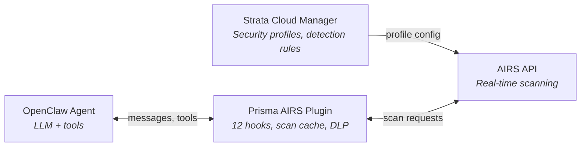

<div class="hero" markdown>

{ .hero-logo }

# Prisma AIRS Plugin

**Defense-in-depth AI security for OpenClaw agents**

[](https://www.npmjs.com/package/@cdot65/prisma-airs)
[](https://opensource.org/licenses/MIT)
[](https://nodejs.org/)
[](https://www.typescriptlang.org/)

</div>

---

OpenClaw plugin for [Prisma AIRS](https://www.paloaltonetworks.com/prisma/prisma-ai-runtime-security) (AI Runtime Security) from Palo Alto Networks. 12 security hooks provide layered protection — blocking, scanning, auditing — across every stage of the agent lifecycle.

<div class="grid cards" markdown>

- :material-shield-lock:{ .lg .middle } **Hard Blocking**

    ***

    Block unsafe content at the persistence layer. Inbound and outbound messages are scanned before they are written — threats never reach the conversation history.

    [:octicons-arrow-right-24: Blocking hooks](hooks/index.md#blocking-hooks)

- :material-magnify-scan:{ .lg .middle } **Full-Context Scanning**

    ***

    Scan assembled conversation context before prompt build. Catches multi-message injection attacks that single-message scanning misses. DLP redaction strips PII from tool outputs.

    [:octicons-arrow-right-24: Scanning hooks](hooks/index.md#scanning-context-hooks)

- :material-clipboard-check:{ .lg .middle } **Audit Logging**

    ***

    Every message, LLM call, and tool execution scanned through AIRS with structured JSON audit logs. Definitive compliance trail at every boundary.

    [:octicons-arrow-right-24: Audit hooks](hooks/index.md#audit-hooks)

- :material-hammer-wrench:{ .lg .middle } **Tool Gating**

    ***

    Block dangerous tools (Bash, Write, Edit) during active threats. Two layers: cache-based gating from message scans, plus active AIRS scanning of tool inputs before execution.

    [:octicons-arrow-right-24: Tool gating guide](guides/tool-gating.md)

- :material-eye-off:{ .lg .middle } **DLP Masking**

    ***

    Mask sensitive data instead of blocking. SSNs, credit cards, emails, API keys, and phone numbers are redacted in outbound responses and tool outputs.

    [:octicons-arrow-right-24: DLP masking guide](guides/dlp-masking.md)

- :material-tune:{ .lg .middle } **Per-Hook Configuration**

    ***

    Enable or disable each of the 12 hooks independently. Choose deterministic (always-on) or probabilistic (model-decides) mode per feature. Fail-closed by default.

    [:octicons-arrow-right-24: Configuration](getting-started/configuration.md)

</div>

## How It Works



**All detection configuration happens in Strata Cloud Manager.** The plugin connects to your SCM security profile and enforces the actions it returns.

## 12 Security Hooks

| Hook | Event | Purpose | Can Block |
|------|-------|---------|-----------|
| [prisma-airs-inbound-block](hooks/prisma-airs-inbound-block.md) | `before_message_write` | Block unsafe user messages | Yes |
| [prisma-airs-outbound-block](hooks/prisma-airs-outbound-block.md) | `before_message_write` | Block unsafe assistant messages | Yes |
| [prisma-airs-outbound](hooks/prisma-airs-outbound.md) | `message_sending` | Block/mask outbound responses | Yes |
| [prisma-airs-tool-guard](hooks/prisma-airs-tool-guard.md) | `before_tool_call` | Scan tool inputs via AIRS | Yes |
| [prisma-airs-tools](hooks/prisma-airs-tools.md) | `before_tool_call` | Gate tools via cached scan | Yes |
| [prisma-airs-prompt-scan](hooks/prisma-airs-prompt-scan.md) | `before_prompt_build` | Full context scanning | No |
| [prisma-airs-tool-redact](hooks/prisma-airs-tool-redact.md) | `tool_result_persist` | Redact PII from tool outputs | No |
| [prisma-airs-context](hooks/prisma-airs-context.md) | `before_agent_start` | Inject threat warnings | No |
| [prisma-airs-guard](hooks/prisma-airs-guard.md) | `before_agent_start` | Security reminder on startup | No |
| [prisma-airs-audit](hooks/prisma-airs-audit.md) | `message_received` | Audit log inbound messages | No |
| [prisma-airs-llm-audit](hooks/prisma-airs-llm-audit.md) | `llm_input` / `llm_output` | Audit log LLM I/O | No |
| [prisma-airs-tool-audit](hooks/prisma-airs-tool-audit.md) | `after_tool_call` | Audit log tool outputs | No |

## Quick Start

```bash
# Install the plugin
openclaw plugins install @cdot65/prisma-airs

# Set your API key (via web UI or config file)
# plugins.entries.prisma-airs.config.api_key = "your-key"

# Restart the gateway
openclaw gateway restart

# Verify
openclaw prisma-airs
```

## Detection Capabilities

Powered by Prisma AIRS (configured in Strata Cloud Manager):

| Category | Description |
|----------|-------------|
| Prompt Injection | Attempts to override agent instructions |
| Data Leakage (DLP) | PII, credentials, sensitive data |
| Malicious URLs | Phishing, malware, disallowed categories |
| Toxic Content | Harmful, abusive, inappropriate content |
| Malicious Code | Malware, exploits, dangerous code |
| AI Agent Threats | Multi-step manipulation attacks |
| Database Security | SQL injection, dangerous queries |
| Grounding Violations | Hallucinations, unverified claims |
| Custom Topics | Organization-specific policy violations |

## Requirements

- Node.js 18+
- OpenClaw v2026.2.1+
- Prisma AIRS API key from [Strata Cloud Manager](https://docs.paloaltonetworks.com/ai-runtime-security)

## Links

- [Prisma AIRS Documentation](https://docs.paloaltonetworks.com/ai-runtime-security)
- [AIRS API Reference](https://pan.dev/prisma-airs/)
- [Prisma AIRS SDK](https://cdot65.github.io/prisma-airs-sdk/)
- [GitHub Repository](https://github.com/cdot65/prisma-airs-plugin-openclaw)
- [npm Package](https://www.npmjs.com/package/@cdot65/prisma-airs)
