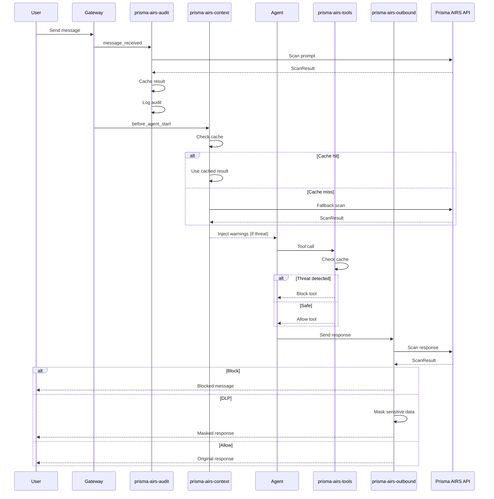
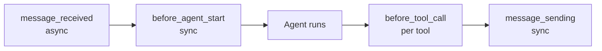
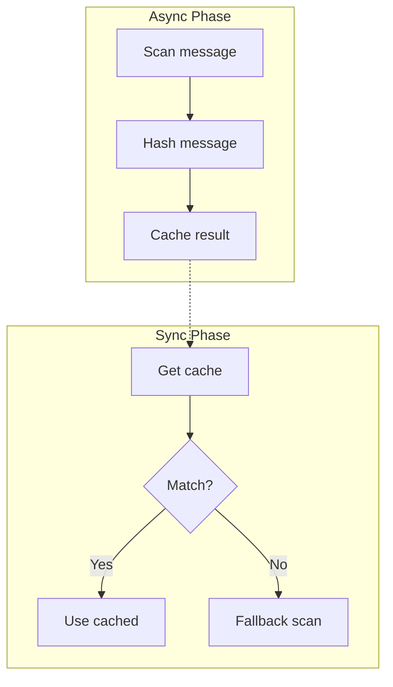

# Architecture Overview

## Components

The Prisma AIRS plugin consists of:

| Component        | File                 | Purpose                                   |
| ---------------- | -------------------- | ----------------------------------------- |
| **Scanner**      | `src/scanner.ts`     | Direct AIRS API integration via `fetch()` |
| **Scan Cache**   | `src/scan-cache.ts`  | Share scan results between hooks          |
| **Plugin Entry** | `index.ts`           | RPC methods, CLI, agent tool registration |
| **Hooks**        | `hooks/*/handler.ts` | Event handlers for security layers        |

## Data Flow



## Hook Execution Order



| Event                | Timing                  | Can Block | Returns                       |
| -------------------- | ----------------------- | --------- | ----------------------------- |
| `message_received`   | Async (fire-and-forget) | No        | void                          |
| `before_agent_start` | Before agent processes  | No\*      | `{ prependContext }`          |
| `before_tool_call`   | Before each tool        | Yes       | `{ block, blockReason }`      |
| `message_sending`    | Before sending          | Yes       | `{ content }` or `{ cancel }` |

\*Cannot directly block, but can inject warnings

## Scan Cache Architecture

The cache bridges async and sync hooks:



### Cache Entry Structure

```typescript
interface CacheEntry {
  result: ScanResult; // Scan result
  timestamp: number; // Cache time
  messageHash?: string; // For stale detection
}
```

### TTL and Cleanup

- **TTL**: 30 seconds
- **Cleanup**: Every 60 seconds
- **Hash validation**: Prevents using results from previous messages

## Plugin Registration

```typescript
export default function register(api: PluginApi): void {
  // 1. Register hooks from directory
  api.registerPluginHooksFromDir(join(__dirname, "hooks"));

  // 2. Register RPC methods
  api.registerGatewayMethod("prisma-airs.scan", handler);
  api.registerGatewayMethod("prisma-airs.status", handler);

  // 3. Register agent tool
  api.registerTool({
    name: "prisma_airs_scan",
    execute: async (_id, params) => scan(params),
  });

  // 4. Register CLI commands
  api.registerCli(({ program }) => {
    program.command("prisma-airs");
    program.command("prisma-airs-scan <text>");
  });
}
```

## AIRS API Integration

### Request Flow

```typescript
const response = await fetch(AIRS_SCAN_ENDPOINT, {
  method: "POST",
  headers: {
    "Content-Type": "application/json",
    "x-pan-token": apiKey,
  },
  body: JSON.stringify({
    ai_profile: { profile_name: "default" },
    contents: [{ prompt: "...", response: "..." }],
    metadata: { app_name: "openclaw" },
  }),
});
```

### Response Mapping

| AIRS Field            | Plugin Field                |
| --------------------- | --------------------------- |
| `action`              | `action` (allow/warn/block) |
| `category`            | Mapped to severity          |
| `prompt_detected.*`   | `promptDetected.*`          |
| `response_detected.*` | `responseDetected.*`        |
| `scan_id`             | `scanId`                    |
| `report_id`           | `reportId`                  |

## Error Handling

### Fail-Closed Mode (Default)

On scan failure:

1. Cache synthetic "block" result
2. Downstream hooks see threat
3. Tools blocked, warnings injected

### Fail-Open Mode

On scan failure:

1. Log error
2. Allow request through
3. No cached result

Configure via `fail_closed: false`.
