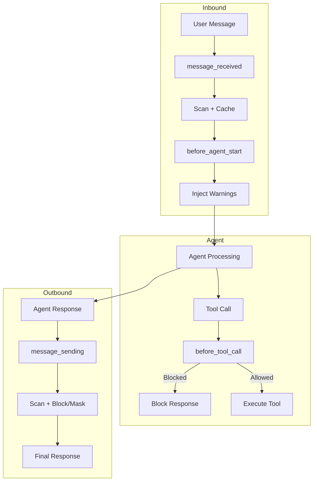

# Prisma AIRS Plugin

[](https://www.npmjs.com/package/@cdot65/prisma-airs)
[](https://opensource.org/licenses/MIT)

OpenClaw plugin for [Prisma AIRS](https://www.paloaltonetworks.com/prisma/prisma-ai-runtime-security) (AI Runtime Security) from Palo Alto Networks.

## Quick Start

```bash
# Install from npm
openclaw plugins install @cdot65/prisma-airs

# Set API key
export PANW_AI_SEC_API_KEY="your-key"

# Restart gateway
openclaw gateway restart

# Test
openclaw prisma-airs-scan "test message"
```

## Features

### Multi-Layer Security

The plugin provides defense-in-depth with 5 security hooks:

| Hook                                                  | Event                | Purpose                                   |
| ----------------------------------------------------- | -------------------- | ----------------------------------------- |
| [prisma-airs-guard](hooks/prisma-airs-guard.md)       | `agent:bootstrap`    | Reminds agents to scan suspicious content |
| [prisma-airs-audit](hooks/prisma-airs-audit.md)       | `message_received`   | Audit logging with scan caching           |
| [prisma-airs-context](hooks/prisma-airs-context.md)   | `before_agent_start` | Injects threat warnings into context      |
| [prisma-airs-outbound](hooks/prisma-airs-outbound.md) | `message_sending`    | Blocks/masks outbound responses           |
| [prisma-airs-tools](hooks/prisma-airs-tools.md)       | `before_tool_call`   | Gates dangerous tools                     |

### Detection Capabilities

Powered by Prisma AIRS, the plugin detects:

- **Prompt Injection** - Attempts to override agent instructions
- **Data Leakage** - PII, credentials, sensitive data (DLP)
- **Malicious URLs** - Phishing, malware, disallowed categories
- **Toxic Content** - Harmful, abusive, inappropriate content
- **Malicious Code** - Malware, exploits, dangerous code
- **AI Agent Threats** - Multi-step manipulation attacks
- **Database Security** - SQL injection, dangerous queries
- **Grounding Violations** - Hallucinations, unverified claims
- **Custom Topics** - Organization-specific policy violations

### DLP Masking

Instead of blocking responses with sensitive data, the plugin can mask them:

```
Before: "Your SSN is 123-45-6789"
After:  "Your SSN is [SSN REDACTED]"
```

### Tool Gating

Block dangerous tools during active threats:

```
Threat: prompt_injection
Blocked: exec, Bash, gateway, message, cron
```

## Architecture



## Configuration

```yaml
plugins:
  prisma-airs:
    profile_name: "default" # AIRS profile
    app_name: "openclaw" # App metadata
    fail_closed: true # Block on scan failure
    dlp_mask_only: true # Mask instead of block for DLP
    reminder_enabled: true # Agent bootstrap reminder
    audit_enabled: true # Inbound audit logging
    context_injection_enabled: true # Threat warning injection
    outbound_scanning_enabled: true # Outbound response scanning
    tool_gating_enabled: true # Tool blocking
```

## Requirements

- Node.js 18+
- OpenClaw v2026.2.1+
- Prisma AIRS API key from [Strata Cloud Manager](https://docs.paloaltonetworks.com/ai-runtime-security)

## Links

- [Prisma AIRS Documentation](https://docs.paloaltonetworks.com/ai-runtime-security)
- [API Reference](https://pan.dev/prisma-airs/)
- [GitHub Repository](https://github.com/cdot65/prisma-airs-plugin-openclaw)
- [npm Package](https://www.npmjs.com/package/@cdot65/prisma-airs)
